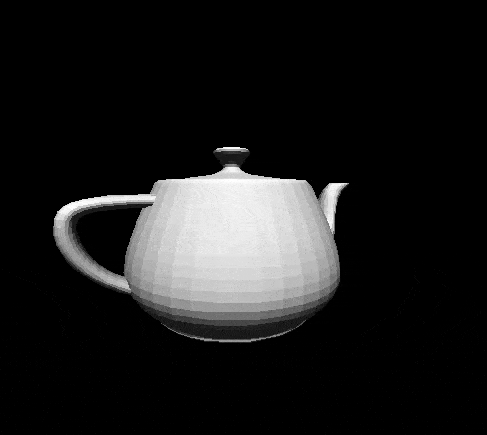

# 3D Engine in Java
<!---

-->
## Description
A 3D graphics engine built from scratch in Java, allowing users to explore and manipulate 3D objects. This engine supports loading .obj files, applying textures, and offers controls to move, rotate, and scale objects. The camera is also fully controllable, enabling smooth navigation through the 3D space for an immersive exploration experience.

## Key Features
- **Object Loading:** Import 3D models in .obj format
- **Texturing:** Apply textures to enhance the visual appearance of objects
- **Object Manipulation:** Move, rotate, and scale objects in the scene
- **Camera Control:** Free navigation and adjustable view within the 3D scene
- **Basic Lighting:** Initial lighting setup for scene illumination

## Planned Enhancements
- **Collision System:** Implement collision detection for more realistic object interactions.
- **Advanced Lighting:** Expand the current lighting system to include support for multiple light sources, adjustable light intensity, and shadows for enhanced realism.
- **Terminal Console:** Add a terminal-based console to control settings, debug information, and input commands directly, facilitating dynamic adjustments during runtime.

## Images

